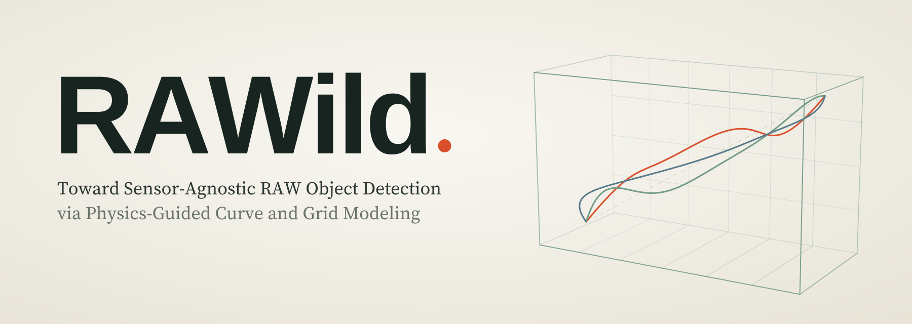
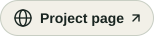
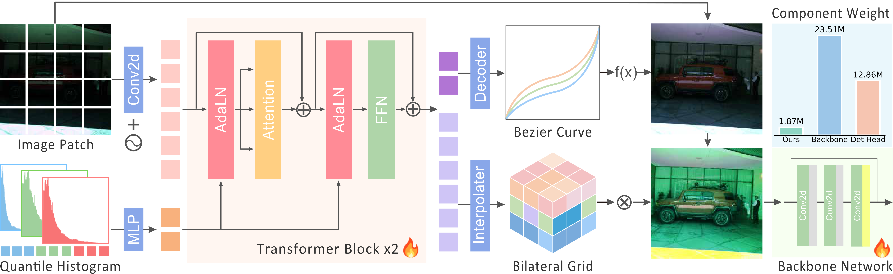
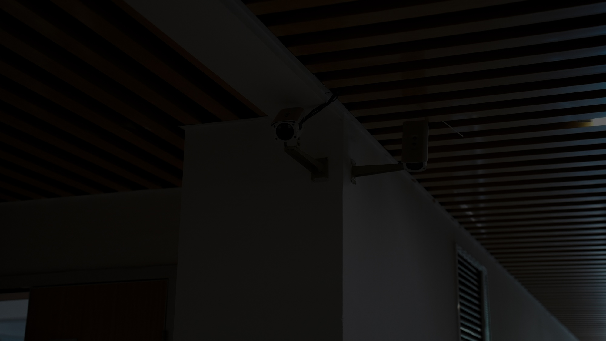
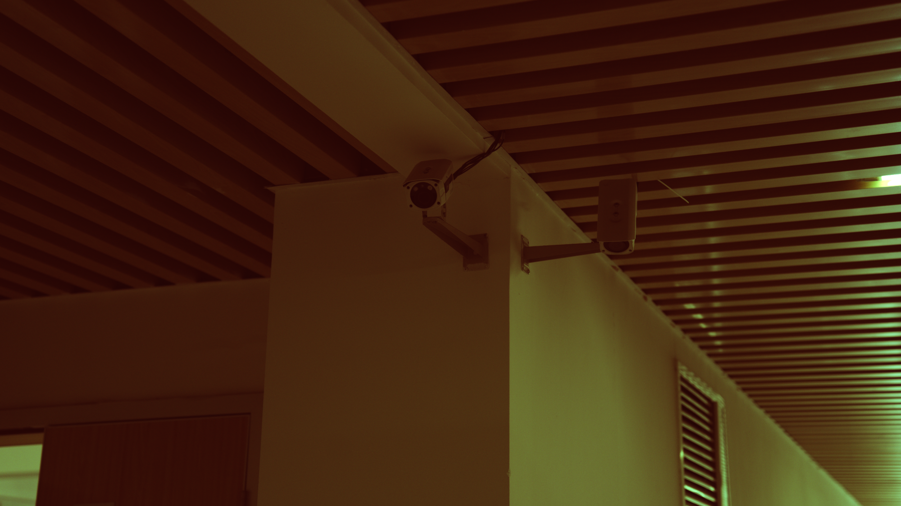
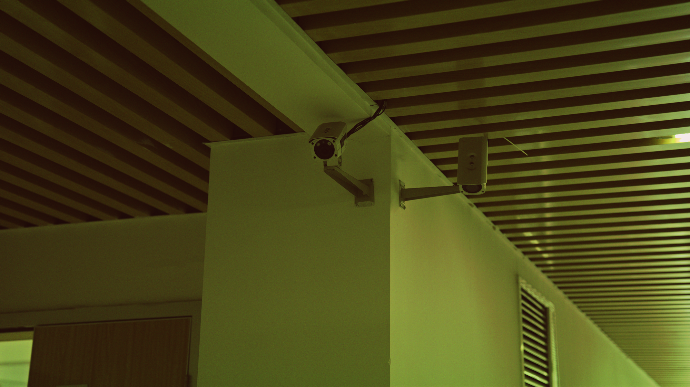
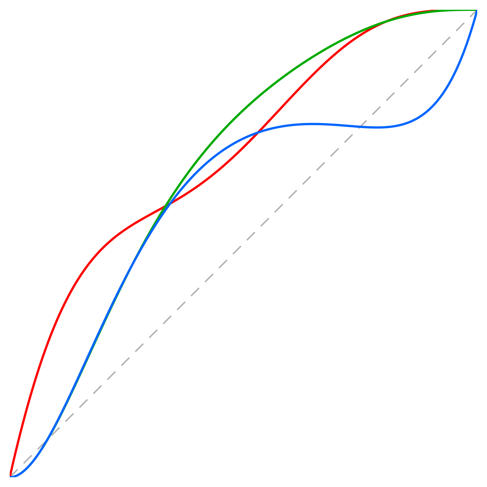

<a id="top"></a>

<div align="center">

<h1>RAWild: Toward Sensor-Agnostic RAW Object Detection via Physics-Guided Curve and Grid Modeling</h1>



<p>⭐ NeurIPS 2026 ⭐</p>

<p>
  <a href="https://shuhongll.github.io/">Shuhong Liu</a><sup>1,2,*</sup>,
  Gengjia Chang<sup>2,*</sup>,
  Jun Liu<sup>2</sup>,
  <a href="https://xg-chu.site/">Xuangeng Chu</a><sup>1,2</sup>,
  <a href="https://www.ai.u-tokyo.ac.jp/ja/members/yqzheng">Yinqiang Zheng</a><sup>1</sup>,
  <a href="https://www.mi.t.u-tokyo.ac.jp/harada/">Tatsuya Harada</a><sup>1,3</sup>, and
  <a href="https://cuiziteng.github.io/">Ziteng Cui</a><sup>1,2,†</sup>
</p>

<p>
  <sup>1</sup>The University of Tokyo &nbsp;
  <sup>2</sup>I2WM &nbsp;
  <sup>3</sup>RIKEN
</p>

<p>
  <sup>*</sup>Equal contribution &nbsp;
  <sup>†</sup>Corresponding author
</p>

<p align="center">
  <a href="https://arxiv.org/abs/2605.05941"></a>
  <a href="https://i2wm.github.io/RAWild/"></a>
  <a href="#resources"></a>
  <a href="https://drive.google.com/drive/folders/1gJlPLMO7Ty0XszLQTJkoZUIxeqbOwKqd?usp=sharing"></a>
</p>

</div>

<p align="center">
  <a href="#overview">Overview</a> &nbsp;·&nbsp;
  <a href="#resources">Resources</a> &nbsp;·&nbsp;
  <a href="#installation">Installation</a> &nbsp;·&nbsp;
  <a href="#object-detection">Detection</a>
  <br>
  <a href="#semantic-segmentation">Segmentation</a> &nbsp;·&nbsp;
  <a href="#raw-simulation">RAW simulation</a> &nbsp;·&nbsp;
  <a href="#visualization">Visualization</a> &nbsp;·&nbsp;
  <a href="#acknowledgments">Acknowledgments</a> &nbsp;·&nbsp;
  <a href="#citation">Citation</a>
</p>

<a id="overview"></a>

##  Overview

RAWild enables sensor-agnostic RAW perception with a lightweight adapter combining a per-image Bezier tone curve and a bilateral-grid color transform.

<p align="center">
  
</p>

<a id="assets"></a>

<a id="resources"></a>

## 📂 Resources

| Resource | Contents | Link |
| --- | --- | --- |
| Project page | Method, results, film, and interactive demos | [Explore RAWild](https://i2wm.github.io/RAWild/) |
| Paper | arXiv:2605.05941 | [Read the paper](https://arxiv.org/abs/2605.05941) |
| Multi-RAW dataset | `RAWild_Mutiraw` | [Google Drive](https://drive.google.com/drive/folders/1zmKUoUyjMoSE2jWIehoAxDQlutD6LC0a?usp=sharing) |
| Simulation data | `Simulation` | [Google Drive](https://drive.google.com/drive/folders/1-x90kmXguv7vsjsIs9w3Kp459byy_hhN?usp=sharing) |
| Checkpoints | Object detection and semantic segmentation | [Google Drive](https://drive.google.com/drive/folders/1gJlPLMO7Ty0XszLQTJkoZUIxeqbOwKqd?usp=sharing) |

<details>
<summary><strong>🗂️ Checkpoint folders and naming</strong></summary>

Checkpoint folders: `Checkpoints/Det` (detection) and `Checkpoints/Seg` (segmentation).
Filenames: `<Backbone>-<Dataset>.pth` for detection (e.g. `ResNet50-PAS.NM.pth`); `<Backbone>-<Domain>.pth` for segmentation (e.g. `MiT-B3-normal.pth`).

</details>

### ⚙️ Configure paths

Set once before running commands:

```bash
export RAWILD_DATA_ROOT=<RAWild_datasets>
export RAWILD_PASCAL_NPY_ROOT="$RAWILD_DATA_ROOT/PASCAL_RAW_npy"
export RAWILD_PRETRAINED_ROOT=<checkpoints/pretrained>
export RAWILD_RELEASE_CKPT_ROOT=<checkpoints/released>
export RAWILD_WORK_DIR_ROOT=work_dirs

export RAWILD_MMSEG_DATA_ROOT="$RAWILD_DATA_ROOT/ADEChallengeData2016"
export RAWILD_MMSEG_WORK_DIR_ROOT=work_dirs/rawild_mmseg
```

`RAWILD_DATA_ROOT` contains `PASCAL_RAW`, `PASCAL_RAW_npy`, `LOD_BMVC2021`, `ROD_dataset`, `AODRaw_dataset`, and `ADEChallengeData2016`.

<a id="installation"></a>

## 📦 Installation

### 🛠️ Detection environment

```bash
conda create -n RAWild_mmdet python=3.8 -y
conda activate RAWild_mmdet

cd mmdetection_github
pip install -U openmim
mim install mmengine
mim install "mmcv>=2.0.0"
pip install -r requirements.txt
pip install -v -e .
```

<details>
<summary><strong>🧩 Segmentation environment (optional)</strong></summary>

```bash
conda create -n RAWild_mmseg python=3.8 -y
conda activate RAWild_mmseg

cd mmsegmentation_github
pip install -r requirements.txt
pip install -e . --no-deps
```

Verified stack: Python 3.8, PyTorch 2.1.0 + CUDA 12.1, MMCV 2.1.0, MMEngine 0.10.4.

</details>

<details>
<summary><strong>🧰 ResNet-50 initialization</strong></summary>

Download the [official COCO-pretrained RetinaNet weights](https://download.openmmlab.com/mmdetection/v2.0/retinanet/retinanet_r50_fpn_1x_coco/retinanet_r50_fpn_1x_coco_20200130-c2398f9e.pth), then extract the backbone:

```bash
cd mmdetection_github
python tools/extract_resnet50_backbone.py /path/to/retinanet_r50_fpn_1x_coco_20200130-c2398f9e.pth
```

The script verifies the source checksum and tensor round trip, then writes a metadata-free `resnet50_backbone.pth` to `$RAWILD_PRETRAINED_ROOT` (default: `checkpoints/pretrained`).

</details>

<a id="object-detection"></a>

## 🎯 Object Detection

<details>
<summary><strong>⚙️ Detection configurations</strong></summary>

| Setting | ResNet-50 | Swin-T |
| --- | --- | --- |
| PASCALRAW normal | `config/RAWild_resnet50/pas_nm.py` | `config/RAWild_swint/pas_nm.py` |
| PASCALRAW low-light | `config/RAWild_resnet50/pas_low.py` | `config/RAWild_swint/pas_low.py` |
| PASCALRAW over-exposure | `config/RAWild_resnet50/pas_oe.py` | `config/RAWild_swint/pas_oe.py` |
| LOD | `config/RAWild_resnet50/lod.py` | `config/RAWild_swint/lod.py` |
| PASCALRAW + LOD mix | `config/RAWild_resnet50/pascal_lod_mix.py` | `config/RAWild_swint/pascal_lod_mix.py` |
| ROD | `config/RAWild_resnet50/rod.py` | `config/RAWild_swint/rod.py` |
| AODRaw | `config/RAWild_resnet50/aodraw.py` | `config/RAWild_swint/aodraw.py` |

</details>

### 📊 Detection results

| Dataset | ResNet-50 @50 | ResNet-50 @75 | Swin-T @50 | Swin-T @75 |
| --- | ---: | ---: | ---: | ---: |
| PAS.LOW | 0.8911 | 0.7332 | 0.9083 | 0.7406 |
| PAS.NM | 0.9019 | 0.7690 | 0.9342 | 0.7792 |
| PAS.OE | 0.9020 | 0.7690 | 0.9313 | 0.7921 |
| LOD | 0.6909 | 0.4363 | 0.6986 | 0.5057 |
| ROD | 0.5541 | 0.3752 | 0.5191 | 0.3467 |
| AODRAW | 0.3623 | 0.2311 | 0.4394 | 0.3263 |

<details>
<summary><strong>🏋️ Detection training and evaluation commands</strong></summary>

#### 🏋️ Train

```bash
cd mmdetection_github

python tools/train.py config/RAWild_resnet50/pascal_lod_mix.py
python tools/train.py config/RAWild_swint/pascal_lod_mix.py
```

#### ⚡ Distributed training

```bash
bash tools/dist_train.sh config/RAWild_resnet50/pascal_lod_mix.py 4
bash tools/dist_train.sh config/RAWild_swint/pascal_lod_mix.py 4
```

#### 🧪 Evaluate

```bash
python tools/test.py \
  config/RAWild_resnet50/pas_nm.py \
  "$RAWILD_RELEASE_CKPT_ROOT/ResNet50-PAS.NM.pth"

python tools/test.py \
  config/RAWild_swint/pas_nm.py \
  "$RAWILD_RELEASE_CKPT_ROOT/SwinT-PAS.NM.pth"
```

Switch datasets or backbones using the configuration table.

</details>

<a id="semantic-segmentation"></a>

## 🧩 Semantic Segmentation

<details>
<summary><strong>⚙️ Segmentation configurations</strong></summary>

| Backbone | Normal | Low | Over Exposure | Mix |
| --- | --- | --- | --- | --- |
| MiT-B0 | `config/RAWild_mitb0/normal.py` | `config/RAWild_mitb0/low.py` | `config/RAWild_mitb0/oe.py` | `config/RAWild_mitb0/mix.py` |
| MiT-B3 | `config/RAWild_mitb3/normal.py` | `config/RAWild_mitb3/low.py` | `config/RAWild_mitb3/oe.py` | `config/RAWild_mitb3/mix.py` |
| MiT-B5 | `config/RAWild_mitb5/normal.py` | `config/RAWild_mitb5/low.py` | `config/RAWild_mitb5/oe.py` | `config/RAWild_mitb5/mix.py` |

</details>

### 📊 Segmentation results

| Backbone | LOW mIoU | NM mIoU | OE mIoU |
| --- | ---: | ---: | ---: |
| MiT-B0 | 0.2872 | 0.3534 | 0.3372 |
| MiT-B3 | 0.3957 | 0.4516 | 0.4381 |
| MiT-B5 | 0.4082 | 0.4708 | 0.4560 |

<details>
<summary><strong>🏋️ Segmentation training and evaluation commands</strong></summary>

#### 🏋️ Train

```bash
cd mmsegmentation_github

python tools/train.py config/RAWild_mitb0/mix.py
python tools/train.py config/RAWild_mitb3/mix.py
python tools/train.py config/RAWild_mitb5/mix.py
```

#### ⚡ Distributed training

```bash
bash tools/dist_train.sh config/RAWild_mitb0/mix.py 4
bash tools/dist_train.sh config/RAWild_mitb3/mix.py 4
bash tools/dist_train.sh config/RAWild_mitb5/mix.py 4
```

#### 🧪 Evaluate

```bash
python tools/test.py \
  config/RAWild_mitb0/mix.py \
  "$RAWILD_RELEASE_CKPT_ROOT/rawild_mitb0_mix.pth"

python tools/test.py \
  config/RAWild_mitb3/mix.py \
  "$RAWILD_RELEASE_CKPT_ROOT/rawild_mitb3_mix.pth"

python tools/test.py \
  config/RAWild_mitb5/mix.py \
  "$RAWILD_RELEASE_CKPT_ROOT/rawild_mitb5_mix.pth"
```

Paper evaluation: single-scale sliding window, no TTA.

</details>

<a id="raw-simulation"></a>

## 🧬 RAW Simulation

<details>
<summary><strong>🧬 RAW simulation commands (optional)</strong></summary>

### 📥 Prepare source RAW images

Skip preprocessing for released `PASCAL_RAW_npy` data; use this only for original PASCALRAW `.nef` files.

```bash
cd mmdetection_github

python PASCAL_RAW_pre_process.py \
  --raw-root <PASCAL_RAW_NEF_DIR> \
  --out-root "$RAWILD_DATA_ROOT/PASCAL_RAW/original"
```

### 🧪 Generate synthetic data

```bash
python tools/syn_spec/generate_pascal_normal_mixbit.py \
  --source-root "$RAWILD_PASCAL_NPY_ROOT/demosaic_normal_12bit" \
  --train-list "$RAWILD_DATA_ROOT/PASCAL_RAW/trainval/train.txt" \
  --val-list "$RAWILD_DATA_ROOT/PASCAL_RAW/trainval/val.txt" \
  --output-root "$RAWILD_WORK_DIR_ROOT/syn_spec/pascal_normal_mixbit" \
  --bit-depths 8 9 10 11 12
```

### 🔍 Inspect camera-seed variants

```bash
python tools/syn_spec/visualize_camera_seed_views.py \
  --sample-id 2014_000022 \
  --source-root "$RAWILD_PASCAL_NPY_ROOT/demosaic_normal_12bit" \
  --output-root "$RAWILD_WORK_DIR_ROOT/syn_spec/camera_seed_views"
```

</details>

<a id="visualization"></a>

## 🎨 Visualization

| Input | Bezier |
| --- | --- |
|  |  |

| Bezier + Grid | Curve |
| --- | --- |
|  |  |

<details>
<summary><strong>🎛️ Generate adapter visualizations</strong></summary>

### 🎛️ Adapter outputs

```bash
cd mmdetection_github

NO_ALBUMENTATIONS_UPDATE=1 python tools/visual_selection/visualize_bezier.py \
  --config config/RAWild_resnet50/pas_nm.py \
  --checkpoint "$RAWILD_RELEASE_CKPT_ROOT/ResNet50-PAS.NM.pth" \
  --image-key 2014_000001 \
  --out-dir "$RAWILD_WORK_DIR_ROOT/visual_selection/pas_nm"
```

### 📈 Export the Bezier curve only

```bash
NO_ALBUMENTATIONS_UPDATE=1 python tools/visual_selection/visualize_bezier.py \
  --config config/RAWild_resnet50/pas_nm.py \
  --checkpoint "$RAWILD_RELEASE_CKPT_ROOT/ResNet50-PAS.NM.pth" \
  --image-key 2014_000001 \
  --out-dir "$RAWILD_WORK_DIR_ROOT/visual_selection/pas_nm_curve" \
  --curve-only
```

</details>

<a id="acknowledgments"></a>

## 🙏 Acknowledgments

This work was partially supported by JST Moonshot R&D Grant Number JPMJPS2011.
Shuhong Liu was supported by JST BOOST, Japan Grant Number JPMJBS2418.

<a id="citation"></a>

## 📚 Citation

If you find this work useful, please cite:

```bibtex
@article{liu2026rawild,
  title={RAWild: Sensor-Agnostic RAW Object Detection via Physics-Guided Curve and Grid Modeling},
  author={Liu, Shuhong and Chang, Gengjia and Liu, Jun and Chu, Xuangeng and Zheng, Yinqiang and Harada, Tatsuya and Cui, Ziteng},
  journal={arXiv preprint arXiv:2605.05941},
  year={2026}
}
```

---

<p align="center">
  <strong>From sensors to understanding.</strong><br>
  <a href="https://i2wm.github.io/RAWild/">Explore the project</a> &nbsp;·&nbsp;
  <a href="#top">Back to top ↑</a>
</p>
